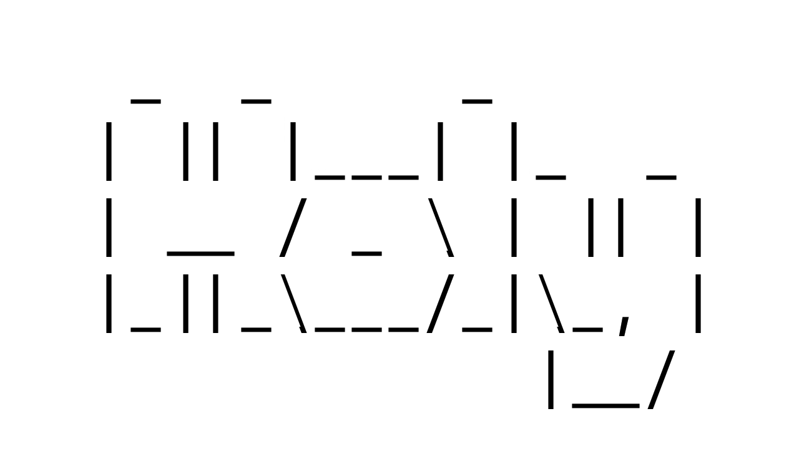

<div align="center">




independent linux distribution.

`c` `linux` `distribution`

</div>

## build

Requires libarchive, libelf, libcurl, OpenSSL and libsolv development files:

```sh
make
make check
make check-root
```

`make install` installs the current `holypkg` prototype, man pages and generated
`llm.txt`. Fixtures also need tar, lz4, sha256sum, GCC, setfattr, setfacl,
objcopy, as and ld.
`make check` includes the internal libsolv fixture. libsolv development files
must be available through pkg-config; the check fails if they are absent.
`make check-root` exercises package mutations only inside disposable target
directories. It does not test a booted system.
`make check-qemu-gate` runs negative BIOS/TCG fixtures.
`make bootstrap-busybox INPUTS=DIR OUTPUT=DIR` builds a pinned musl-static
BusyBox package. See [holypkg(8)](man/holypkg.8) for inputs and its chroot test.
`make static-deps` and `make static` build the musl-static core from pinned
inputs; `make check-static-core` exercises package operations inside a libc-free chroot.
`make bootstrap-image` builds a test ISO from explicit pinned packages and runs
its QEMU boot probe. See [holy-image(7)](man/holy-image.7) for required inputs
and the current coverage. `make check-qemu ARCH=x86_64 ISO=FILE BOOT_PLAN=SHA256`
reruns a supplied image.
